<p align="center">
  
</p>

<p align="center">
  <a href="mailto:amandalal1937@gmail.com"></a>
  <a href="https://github.com/amandalal007"></a>
  <a href="https://tryhackme.com/p/amandalal"></a>
  
  
</p>

<p align="center">
  <a href="https://tryhackme.com/p/amandalal"></a>
</p>

---

<div align="center">

**`> I build defensive security tooling — ML phishing detection, scam/fraud intelligence, and recon automation. Hands-on with TryHackMe red/blue labs, and I ship full-stack apps across the stack.`**

</div>

---


### `// projects`

| Repository | Stack | Focus |
|------------|-------|-------|
| [PhishGuard Enterprise](https://github.com/amandalal007/phishguard-enterprise) | Python · PyQt6 · scikit-learn | 🔒 ML phishing detection — VirusTotal, RDAP, 18 recon scanners, 0–100 risk score |
| [AI Scam Shield](https://github.com/amandalal007/AI-Scam-Shield) | Python · JS · Web | 🔒 Multi-modal scam/fraud detection: screenshots, messages, URLs, UPI |
| [Pocketfy](https://github.com/amandalal007/full-stack-development) | Node.js · Express · MongoDB | 🌐 Full-stack music streaming — auth, playlists, search |
| [Java College Projects](https://github.com/amandalal007/java-college-projects) | Java · JDBC · Servlets | ☕ OOP / DB connectivity coursework |


### `// arsenal`

<p align="left">
  
  
  
  
  
  
  
  
  
  
  
  
  
  
</p>


### `// status`

```text
[active]   TryHackMe        — red/blue team labs, ranked operator  (@amandalal)
[building] PhishGuard Ent.   — shipping recon + ML detection to GitHub
[learning] RE · malware anal. · CTF tradecraft
```

---

<p align="center">
  <i>"I manipulate things to make them work the way I want."</i><br/><br/>
  <a href="mailto:amandalal1937@gmail.com"><b>📡 ping me — open to security internships & collaboration</b></a>
</p>
